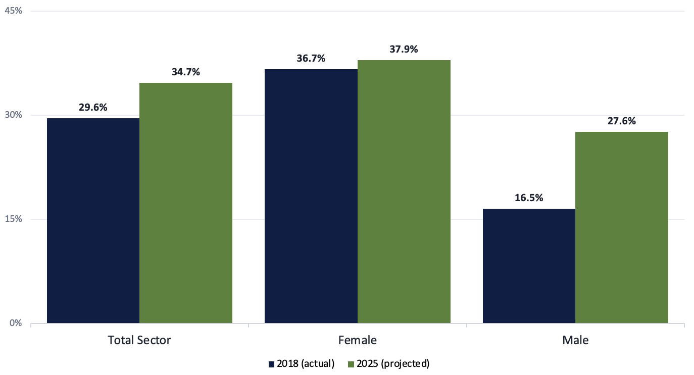

# NSW Public Sector Part-Time Workforce Analysis

### *Equal Part-Time Workforce Representation — A Briefing for the Workforce Diversity Steering Committee*


A data analytics case study analysing five years of NSW public sector workforce data to answer one question for the **Workforce Diversity Steering Committee**: *is part-time employment increasing, and is it increasing equally for men and women?* The output is a Director-ready briefing — a discussion paper and slide deck, both backed by a fully worked Excel model — prepared ahead of a senior executive meeting.

**1,891,836** employee records analysed · **10** clusters · **92** agencies · **2014–2018**

## Table of Contents
- [Background](#background)
- [The Brief](#the-brief)
- [About the Data](#about-the-data)
- [Repository Structure](#repository-structure)
- [Methodology](#methodology)
- [Key Findings](#key-findings)
- [Discussion Points for the Committee](#discussion-points-for-the-committee)
- [Limitations & Caveats](#limitations--caveats)
- [Tools & Skills Demonstrated](#tools--skills-demonstrated)
- [Deliverables](#deliverables)
- [Author](#author)
- [License & Attribution](#license--attribution)

## Background

The NSW Public Service Commission (PSC) collects data on the NSW public sector workforce through the **Workforce Profile**, an annual census covering every government cluster and agency. As an analyst, my role is to turn that raw census data into policy-ready analysis — spanning employment arrangements, age profile, and diversity — to support the PSC's workforce planning and policy development agenda.

## The Brief

The Director needed a data-driven answer to one question ahead of a Workforce Diversity Steering Committee meeting: **are part-time employment arrangements increasing across the sector, and how does that vary by gender?** The analysis needed to cover:

- [x] Trends over time in male and female employment, including any notable changes
- [x] The current representation of part-time employees, sector-wide and by cluster
- [x] The current representation of male and female part-time employees as a proportion of the respective male and female workforce, sector-wide and by cluster
- [x] The change in both of the above statistics over the last 4 years
- [x] A projection of part-time representation to 2025 if current trends continue

## About the Data

The analysis draws on Workforce Profile headcount data for **2014–2018**, broken down by cluster, agency, gender, and employment type (full-time / part-time), covering **10 government clusters** and **92 individual agencies**.

The headline **1,891,836** figure is the sum of headcounts across all five years, not a single-year total — the sector's actual annual headcount ranged from ~374,800 to ~382,400 over the period (~378,400 employees per year on average).

| Term | Meaning |
|---|---|
| **Sector / Public Sector** | All agencies and people who work directly for the NSW State Government |
| **Cluster** | A group of agencies that share a common function and report to a Secretary |
| **Headcount** | The number of employees, counted as individual people |
| **pp** | Percentage point — the unit used to describe change in a % |

## Repository Structure

```
.
├── README.md
├── NSWGov_Spreadsheet.xlsx          # Full workbook — raw data + all analysis, pivot tables, and charts
├── NSWGov_DiscussionPaper_PDF.pdf   # 3-page written discussion paper
├── NSWGov_PPT_PDF.pdf               # Slide deck for the Steering Committee meeting
└── assets/
    ├── part-time-trend-by-gender.png
    └── 2025-projection.png
```

**Inside the workbook:**

| Tab | Contents |
|---|---|
| `PT & FT Data Table` | Raw headcount by cluster, agency, year, employment type and gender (wide format) |
| `PT & FT Data PivotTable format` | Same data reshaped to long/tidy format to drive the PivotTables |
| `1` | Trends over time in male and female employment |
| `2` | Current part-time representation — sector-wide (`2a`) and by cluster (`2b`) |
| `3` | Current male/female part-time representation as a share of each gender's workforce — sector-wide (`3a`) and by cluster (`3b`) |
| `4` | Change in part-time representation over the last 4 years, sector-wide (`4a`) and by cluster (`4b`); change in male/female part-time representation as a share of each gender's workforce over the last 4 years, sector-wide (`4c`) and by cluster (`4d`) |
| `5` | Male/female part-time representation over time and projection to 2025 (`5a`); part-time workforce representation and projection to 2025 (`5b`) |
| `6` / `6 (continued)` | Cluster-level trajectories and 2025 forecasts, with caveats on clusters that didn't move linearly |

## Methodology

1. **Reshape** — raw census extracts (one row per cluster / agency / year / employment type / gender) converted into a long/tidy table to drive Excel PivotTables.
2. **Rate calculation** — `% part-time = part-time headcount ÷ (part-time + full-time headcount)`, calculated at sector, cluster and gender level for each year, 2014–2018.
3. **Change** — measured in **percentage points (pp)**, i.e. the arithmetic difference between the 2014 and 2018 rate, not a percentage growth rate.
4. **Projection to 2025** — linear extrapolation: the average annual pp change from 2014–2018 is held constant and extended forward seven years from 2018.
5. **Sense-check** — cluster-level trends were reviewed individually before projecting; where a trend was clearly non-linear (see [Limitations](#limitations--caveats)), the projection is flagged rather than presented at face value.

## Key Findings

### 1. Headcount fell slightly, driven by a drop in male employees
Total sector headcount fell **0.76%** between 2014 and 2018 (382,385 → 379,460). That fall was driven almost entirely by male headcount, down **3.05%** (−4,198 people), while female headcount grew **0.52%** (+1,273). As a result, the female share of the sector rose from **64.0% to 64.8%**, and the male share fell from **36.0% to 35.2%**.

### 2. Part-time employment is rising — fastest among men


The sector-wide part-time rate rose from **26.7% to 29.6% (+2.9pp)**. The gender gap in part-time work is still wide, but it moved: the **female** part-time rate barely shifted (35.9% → 36.7%, +0.7pp), while the **male** part-time rate more than doubled its percentage-point contribution (10.2% → 16.5%, +6.3pp) — even as full-time male headcount was shrinking.

### 3. The picture varies sharply by cluster
Part-time growth is concentrated in a few clusters, and not all of them moved the same direction:

- **Largest increase:** Finance, Services & Innovation, **+14.5pp**
- **Largest decrease:** Family & Community Services, **−19.1pp** — the sector's only double-digit decline
- **Education** is the only cluster above 40% part-time (**44.2%** in 2018), and the single biggest contributor to the sector-wide increase
- The **gender gap** in part-time rates varies from **~5pp in Transport** to **~20pp in Planning & Environment** — in every cluster, women are more likely than men to work part-time

The table below has the full picture for all 10 clusters — the overall part-time rate, and the male/female split behind it:

<details>
<summary><strong>Full cluster breakdown (2014 vs 2018)</strong></summary>
<br>

**Overall part-time rate, by cluster**

| Cluster | 2014 % PT | 2018 % PT | pp change |
|---|---:|---:|---:|
| Education | 39.74% | 44.20% | +4.46 |
| Family & Community Services | 33.23% | 14.16% | −19.07 |
| Finance, Services & Innovation | 9.69% | 24.16% | +14.47 |
| Health | 30.80% | 33.15% | +2.35 |
| Industry | 12.19% | 6.66% | −5.53 |
| Justice | 8.85% | 10.57% | +1.72 |
| Planning & Environment | 13.57% | 14.19% | +0.62 |
| Premier & Cabinet | 13.86% | 12.92% | −0.95 |
| Transport | 9.92% | 14.23% | +4.31 |
| Treasury | 5.73% | 9.74% | +4.01 |
| **Total Sector** | **26.67%** | **29.58%** | **+2.91** |

**Part-time rate by cluster, split by gender** — i.e. female part-time headcount ÷ total female headcount (and the same for male), so each column reads as a share of that gender's own workforce, not of total headcount.

| Cluster | Female 2014 | Female 2018 | Δpp (F) | Male 2014 | Male 2018 | Δpp (M) |
|---|---:|---:|---:|---:|---:|---:|
| Education | 45.88% | 46.84% | +0.95 | 20.13% | 35.34% | +15.21 |
| Family & Community Services | 36.92% | 16.92% | −20.00 | 21.35% | 4.69% | −16.66 |
| Finance, Services & Innovation | 15.39% | 27.02% | +11.63 | 2.90% | 19.97% | +17.07 |
| Health | 36.21% | 37.73% | +1.53 | 15.20% | 19.92% | +4.72 |
| Industry | 17.99% | 10.86% | −7.13 | 5.13% | 1.98% | −3.16 |
| Justice | 20.20% | 18.84% | −1.36 | 1.54% | 5.07% | +3.53 |
| Planning & Environment | 25.35% | 24.70% | −0.65 | 5.16% | 5.13% | −0.02 |
| Premier & Cabinet | 18.33% | 17.40% | −0.92 | 7.72% | 6.27% | −1.45 |
| Transport | 25.30% | 18.22% | −7.08 | 5.25% | 12.95% | +7.71 |
| Treasury | 7.65% | 14.18% | +6.53 | 2.38% | 2.99% | +0.61 |
| **Total Sector** | **35.94%** | **36.67%** | **+0.72** | **10.17%** | **16.52%** | **+6.35** |

</details>

### 4. Projected to 2025, the gender gap narrows but doesn't close


Extrapolating current trends forward on a linear basis, sector-wide part-time representation reaches **34.7%** by 2025 (female **37.9%**, male **27.6%**). The gender gap in part-time rates narrows from roughly **20 points today to around 10 points by 2025** — a meaningful shift, but not full convergence.

## Discussion Points for the Committee

The paper closes with four open questions, designed to prompt the Committee's discussion rather than pre-empt it:

1. **Education's outsized role** — is its >40% part-time rate driven by the availability of part-time roles, workforce demand, or both?
2. **Rising male part-time uptake** — male part-time representation grew from 10.2% to 16.5% in four years, even as full-time male headcount fell. What's driving this?
3. **Uneven progress across clusters** — the gender gap ranges from 5pp (Transport) to nearly 20pp (Planning & Environment). Should the clusters furthest from equal representation be prioritised?
4. **The road to 2025** — even on current trends, a real gender gap is projected to remain. What further steps, if any, should the Committee consider?

## Limitations & Caveats

- **Linear extrapolation is a simplifying assumption.** It doesn't account for policy changes, economic shocks, or agency restructures, and it can produce implausible results where a cluster's trend wasn't actually linear to begin with. Extending Family & Community Services' 2014–2018 trend directly, for example, would put its part-time rate below zero within a few years — a modelling artefact, not a realistic outcome. Cluster-level projections should be treated with more caution than the sector-wide figures.
- **Headcount, not FTE.** The analysis counts individual people, not full-time-equivalent hours, so it captures *who* works part-time but not the resulting change in total capacity.
- **Five years of history informs a seven-year forecast.** A short base period increases the sensitivity of the 2025 projection to any single year's movement.

## Tools & Skills Demonstrated

- **Microsoft Excel** — PivotTables and PivotCharts, wide-to-long data reshaping, KPI and percentage-point-change formulas, linear extrapolation for trend forecasting
- **Workforce/diversity analytics** — gender-disaggregated rate analysis at sector and cluster level
- **Stakeholder communication** — one analysis, delivered in two audience-appropriate formats: a written discussion paper and a Steering Committee slide deck

## Deliverables

| Deliverable | Description |
|---|---|
| 📊 [`NSWGov_Spreadsheet.xlsx`](./NSWGov_Spreadsheet.xlsx) | The full Excel workbook — raw data plus every analysis and pivot table behind the findings |
| 📄 [`NSWGov_DiscussionPaper_PDF.pdf`](./NSWGov_DiscussionPaper_PDF.pdf) | The 3-page written discussion paper |
| 📽️ [`NSWGov_PPT_PDF.pdf`](./NSWGov_PPT_PDF.pdf) | The slide deck version, formatted for the Steering Committee meeting |

**Start here:** the discussion paper for the narrative and headline numbers, or the workbook if you want to explore or extend the pivot tables yourself.

*(Links above assume these files sit alongside this README in the repo root — update the paths if your layout differs.)*

## Author

**Amit Sharma** — Data Analytics Case Study Project

## License & Attribution

This analysis is based on workforce data collected by the **NSW Public Service Commission** through its Workforce Profile collection. See the [PSC Workforce Profile](https://www.psc.nsw.gov.au/reports-and-data/workforce-profile) and [data.nsw.gov.au](https://data.nsw.gov.au/data/organization/public-service-commission) for more on the source collection. NSW Government open data is typically published under a Creative Commons Attribution licence — check the relevant dataset page for the exact terms that apply.
